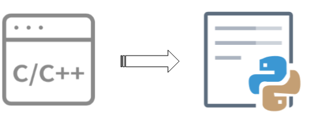

## 修订历史

| Version | **Date**   | **Author** | **Change expression** |
| :------ | ---------- | ---------- | --------------------- |
| 1.0.0   | 2022-05-26 | Pawn       | 初始版本              |

## GateMonitor 介绍

### 产品概述

- GateMonitor，门态开关监测器。
- 终端设备功能涵盖绝大部分GateMonitor应用场景
- 可视化运营平台+手机APP，设备管理和数据查看更方便

### 产品功能

- 门态变化检测
- 声光告警
- 数据实时上报云端
- 设备异常告警

### 产品特点

- 开关门状态检测，设备告警并上报告警信息到云端
- 支持移远云，电信云等多种平台连接
- QuecPython 二次开发，模块化、定制化、缩短开发周期
- 可视化运营平台、手机APP控制终端
- 超低功耗

### 应用行业

- 防疫隔离
- 各类门监测
- 特殊行业

## GateMonitor功能列表

### 设备开机与指示灯

#### 开机提示

- 设备上电自动开机，蜂鸣器短滴一声提示。

#### 网络检测

- 等待设备注网完成，默认等待60s，期间蓝色LED慢闪。
- 联网成功，蜂鸣器长滴一声，蓝色LED灯结束慢闪。
- 连网失败，蜂鸣器短滴两声，红色LED灯常亮。

### 设备声光告警

#### 开门告警

- 蜂鸣器短滴五声，红色LED灯闪烁五次，蜂鸣器与LED灯平频率同步（1次/秒）。
- 上报开门告警事件到云端。

#### 关门告警

- 蜂鸣器短滴一声，蓝色LED灯闪烁一次，蜂鸣器与LED灯平频率同步（1次/秒）。
- 上报关门告警事件到云端。

#### SOS一键告警

- 蜂鸣器短滴三声,红色LED闪烁两次（1次/秒）。
- 上报SOS告警事件至云端。

### 设备低电告警

- 设备唤醒后检测电量若低于百分之十向云端发送低电告警事件。

### 硬件拨码开关

- 拨码开关拨向使能位置，使能开关门声光告警功能。
- 拨码开关拨向关闭使能位置，设备无声光提示告警，只上传告警事件到云端。

### 低功耗模式

- 设备开机后等待程序任务执行结束后将自动进入休眠模式（PSM）。
- 设备休眠状态下设备可被定时唤醒，也可通过开关门唤醒，SOS都会唤醒设备。

### 定时心跳

#### 设备定时唤醒

- 设定设备间隔每12小时唤醒一次并上报设备信息到云端，包含设备剩余电量以及设备状态。

## 移远GateMonitor及其能力

### 产品能力

- **通道支持移远云、电信云多种云平台(目前暂只支持移远云，其他平台正在开发中)**
- **支持OTA升级**
- **支持数据离线存储**
  - 在网络连接不稳定情况下，将发送失败的数据暂存至本地，在网络恢复后优先将本地数据发送至云端
  - 离线存储的数据量可通过配置文件配置
- **支持QuecPython，可以使用Python代码快速实现二次开发**

### 产品优势

- **Cloud**
  - 可使用quecthing SDK 一键连云

- **超低功耗**
  - -NB 模组超低功耗，普通7号干电池，待机>300天

- **低成本开发**

  - -可使用Python进行二次开发，降低软件开发成本

  

  - 我司多平台模组适用，使用Python开发，无需修改代码即可快速切换至不同模组

- **强大的客户服务和技术支持能力**

## 移远GateMonitor的工作流程

设备检测到告警事件，上报告警消息到云端并转发APP或其它通知

## 拉取完整代码工程

### 说明

本项目包含有一个`modules`子项目, 拉取代码时需将子项目一并拉去下来进行使用。

### 拉取步骤

1 拉取主项目代码

- `git clone https://gitee.com/qpy-solutions/GateMonitor.git`

2 进入项目根目录

- `cd GateMonitor/`

3 切换对应的主项目分支

- `git checkout master`

4 子项目初始化

- `git submodule init`

5 子项目代码拉取

- `git submodule update`

6 进入子项目目录

- `cd code/modules/`

7 切换对应的子项目分支

- `git checkout master`
