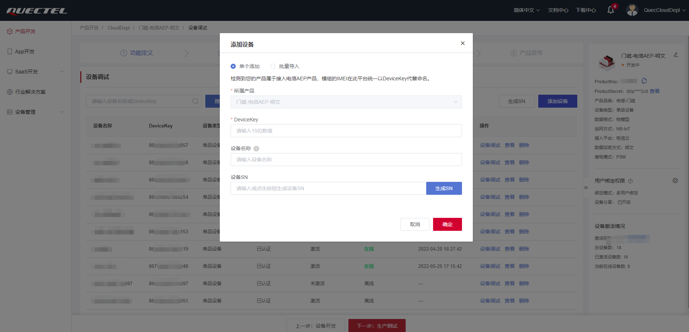

# GateMonitor 公版方案用户指导手册

## 项目简介

> 项目旨在为Python开发者提供一个GateMonitor项目的功能模板与组件，方便开发者快速开发GateMonitor嵌入式业务功能。

## 内置功能模块

- [x] 移远云(quecthing): 提供移远云物联网物模型的消息发布与订阅，OTA升级功能。
- [x] 电池模块(battery): 提供设电池电量，电压数据查询
- [x] LED模块(led): 提供LED开关控制功能，周期性闪烁功能。
- [x] Buzzer(buzzer): 提供蜂鸣器开关控制功能，周期性蜂鸣功能。
- [x] 日志模块(logging): 提供日志打印功能。
- [x] 低功耗模块(mpower): 提供周期性低功耗唤醒功能。
- [x] 云服务中间件(remote): 提供云服务消息处理中间件功能。
- [x] 历史文件保存(history): 提供数据保存

## 项目结构

```
|--code
    |--main.py
    |--quec_object_model.json
    |--settings.py
    |--gateMonitor.py
    |--gateMonitor_collector.py
    |--modules
        |--battery.py
        |--common.py
        |--history.py
        |--peripherals.py
        |--mpower.py
        |--quecthing.py
        |--remote.py
```

## 项目配置

### 硬件设备

推荐的硬件设备

- NB BC25PA

### 云服务平台

移远云

1. [创建产品与设备](https://iot-cloud-docs.quectelcn.com/quickStart/ProductDevelop.html)




2. [为产品定义物模型](https://iot-cloud-docs.quectelcn.com/quickStart/ProductDevelop.html)


3. 项目提供了[物模型demo](https://gitee.com/qpy-solutions/tracker-v2/blob/dev/object_model_demo/quec_cloud_object_model.json), 可直接导入生成，无需手动创建


4. 导出JSON格式的物模型, 重命名后, 放入项目根目录`code`下, 建议命名`quec_object_model.json`


### 设置项目配置参数

#### 项目基础配置(settings-SYSConfig)

```python
debug = True  # 是否开启debug日志
log_level = "DEBUG"  # 日志等级
cloud = _cloud.quecIot  # 设置云服务平台
checknet_timeout = 60  # 网络检测超时时间
base_cfg = {
    "LocConfig": True,  # 是否启用定位模块
}
user_cfg = True  # 是否启用用户配置模块
```

#### 移远云配置(settings_QuecCloudConfig)

```python
PK = "{ProductKey}"  # 产品KEY
PS = "{ProductSecret}"  # 产品密钥
DK = "{DeviceKey}"  # 设备名称 ，可为空
DS = "{DeviceSecret}"  # 设备密钥 ，可为空
SERVER = ""  # 连接的服务器地址
MODE = 0  # 0 LWM2M, 1 MQTT
LIFETIME = 65500  # 通信之间允许的最长时间段(以秒为单位), 范围(120-65500)
```

#### 设备基础配置(settings_DeviceConfig)

```python
doorState = 0 # door state, 0: open door ,1: close door
lowPowerAlarm = 0 # low power alarm flag, 1: alarm , 0: no alarm
```

#### 用户参数配置(settings_UsrConfig)

```python
rtc_wakeup_period = 43200  # rtc period, default 12h, 3600 * 12 = 43200
```

## 开发工具

推荐使用[QPYcom](https://python.quectel.com/doc/doc/Advanced_development/zh/QuecPythonTools/QPYcom.html)作为项目的调试软件工具

下载地址: https://python.quectel.com/download


## 运行项目

1. 设置好模块的配置参数;
2. 将物模型JSON文件放入项目根目录中;
3. 开发主机安装好设备驱动与调试软件QPYcom;
4. 给设备安装SIM卡，并连接主机启动电源;
5. 打开对应的设备串口，将项目代码通过QPYcom烧录至设备中;


6. 通过交互页面即可查看项目运行状态


7. 在云服务DMP平台查看设备状态信息


## OTA升级

> **固件升级只支持差分升级，不支持整包升级**

### 移远云

> **项目文件升级包，建议以压缩包的形式打包多个项目文件上传云端**

#### 固件升级

1. 制作固件升级差分包(联系固件开发人员);
2. 创建OTA升级模型，添加固件组件，MCU组件(用于项目升级)
   + 固件类型的组件标识以设备平台名称命名，如: `EC600N-CNLC`.
   + MCU类型的组件标识以`settings.py`中`PROJECT_NAME`命名，如: `QuecPython-GateMonitor`.


3. 创建固件版本升级包


4. 创建固件升级计划


5. 等待设备升级，查看升级结果

   + 当设备开启OTA升级和OTA自动升级，则等待设备升级完成，查看升级结果;

   